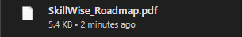

<p align="center">
  
</p>

<h1 align="center">
  🧠 SkillWise – AI-Powered Learning Path Generator
</h1>

<p align="center">
  Upload your resume and get a personalized 6-month learning roadmap with free courses, project ideas, and a career plan – powered by Gemini 1.5 Flash.
</p>

<p align="center">
  <a href="https://skillwise-sahaj33.streamlit.app/" target="_blank">
    
  </a>
  &nbsp;
  <a href="https://github.com/Sahaj33-op/SkillWise/stargazers">
    
  </a>
  &nbsp;
  <a href="https://github.com/Sahaj33-op/SkillWise/network/members">
    
  </a>
</p>

<p align="center">
  <a href="#-features">🚀 Features</a> •
  <a href="#-screenshots">📸 Screenshots</a> •
  <a href="#-usage">💻 Usage</a> •
  <a href="#-roadmap">🧰 Roadmap</a> •
  <a href="#-license">📜 License</a>
</p>

---

```
░██████╗██╗░░██╗██╗██╗░░░░░██╗░░░░░░██╗░░░░░░░██╗██╗░██████╗███████╗
██╔════╝██║░██╔╝██║██║░░░░░██║░░░░░░██║░░██╗░░██║██║██╔════╝██╔════╝
╚█████╗░█████═╝░██║██║░░░░░██║░░░░░░╚██╗████╗██╔╝██║╚█████╗░█████╗░░
░╚═══██╗██╔═██╗░██║██║░░░░░██║░░░░░░░████╔═████║░██║░╚═══██╗██╔══╝░░
██████╔╝██║░╚██╗██║███████╗███████╗░░╚██╔╝░╚██╔╝░██║██████╔╝███████╗
╚═════╝░╚═╝░░╚═╝╚═╝╚══════╝╚══════╝░░░╚═╝░░░╚═╝░░╚═╝╚═════╝░╚══════╝
```
---


## ✨ Features

- 📄 Resume Upload (.pdf supported)
- 🧠 AI Roadmap Generation using Gemini 1.5 Flash
- 🛠️ Skill Gap & Match Score for targeted learning
- 📝 Free Course Suggestions from top platforms
- 💻 Project Recommendations to build your portfolio
- ✅ Progress Checklist with persistent tracking
- 🌃 Dark/Light Mode Toggle
- 📂 Download Roadmap as `.txt`, `.pdf`, or `.json`
- ↺ Live Roadmap Editing + Q&A
- 🗃️ Multi-role support (e.g., AI PM, Web Dev, Blockchain)

---

## 📸 Screenshots

| Resume Upload | Generated Roadmap | PDF Export |
|---------------|-------------------|------------|
|  |  |  |

---

## 💻 Usage

### 🔧 Run Locally

```bash
git clone https://github.com/Sahaj33-op/SkillWise.git
cd SkillWise
pip install -r requirements.txt
streamlit run app.py
```

### 🔐 Add Your API Key

Create a `.env` file in the project root:

```env
GOOGLE_API_KEY=your_api_key_here
```

Or paste the key directly in the Streamlit sidebar UI.

> ⚠️ **Important**: You must provide a valid Google API Key to access Gemini 1.5 Flash capabilities.

---

### 📸 OCR Support for Image-based PDFs

> 💡 **Windows Users**: If using OCR (for image-based PDFs), install [Tesseract OCR](https://github.com/UB-Mannheim/tesseract/wiki) and update your Python config like this:

```python
pytesseract.pytesseract.tesseract_cmd = r"C:\Program Files\Tesseract-OCR\tesseract.exe"
```

> Tesseract is required for extracting text from image-based resumes.

---

<details>
<summary>📦 Click to view <code>requirements.txt</code></summary>

```
streamlit
pytesseract
python-dotenv
pdfplumber
Pillow
reportlab
...
```

</details>

---

## 🌐 Try it Online

> ✅ Deployed on [Streamlit Cloud](https://streamlit.io/cloud)

🔗 [Open the App](https://skillwise-sahaj33.streamlit.app/)

---

## 🧰 Roadmap

- [x] Resume Upload + OCR
- [x] Gemini 1.5 Flash Integration
- [x] Skill Gap Detection
- [x] Dark/Light Theme Toggle
- [x] Download as .txt / .pdf / .json
- [x] Live Roadmap Editing
- [x] Interactive Roadmap Q&A
- [ ] Firebase/Cloud Sync for Progress
- [ ] Multi-tab Layout (Resume / Roadmap / Export)
- [ ] .EXE Packaging for Windows
- [ ] Full Android App (via Kivy or Pydroid)

---

## 🤝 Contributing

Pull requests are welcome. For major changes, please open an issue first to discuss your ideas.

---

## 📜 License

MIT License – see [`LICENSE`](LICENSE) for full terms.

---

<p align="center"><i>Made with 💡 by Sahaj and AI</i></p>
