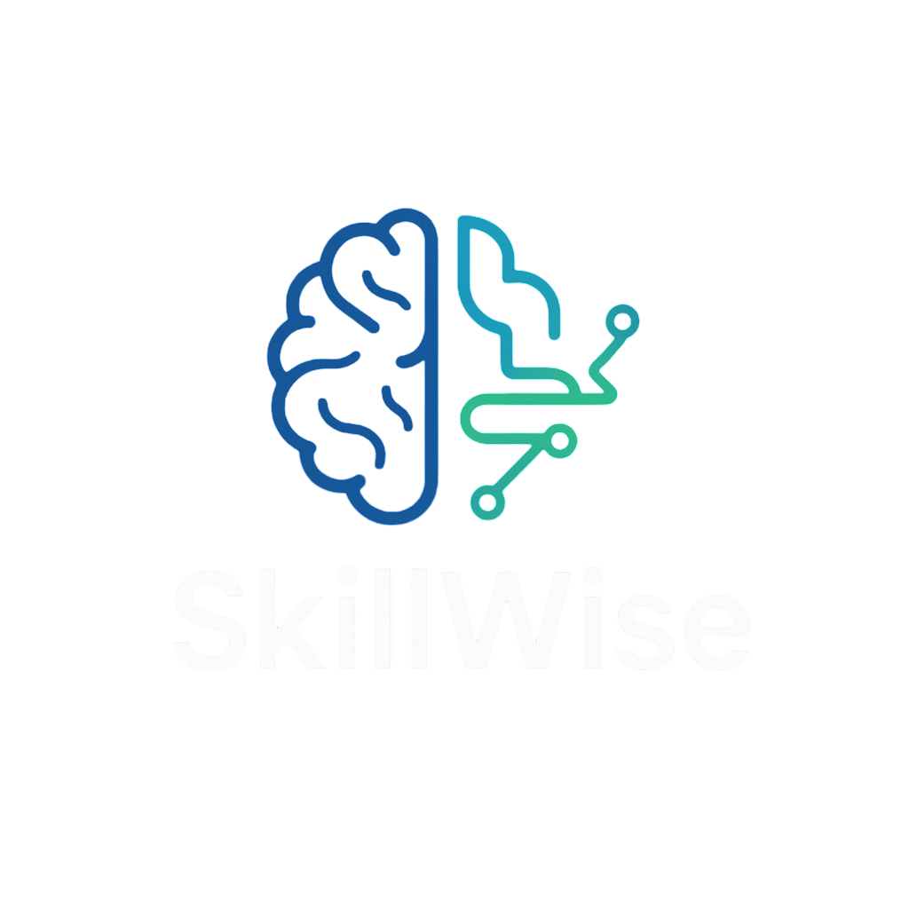
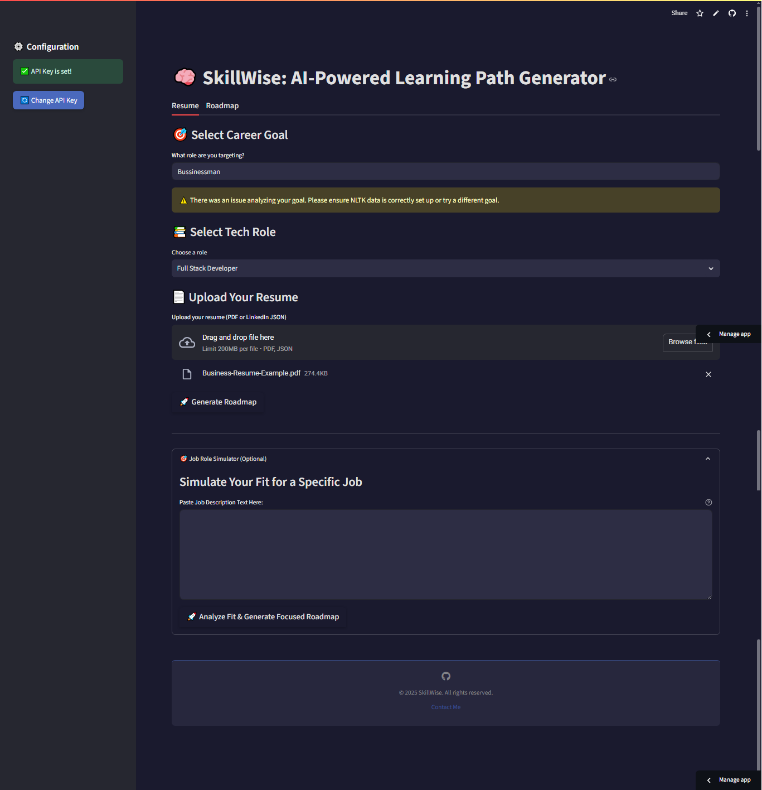
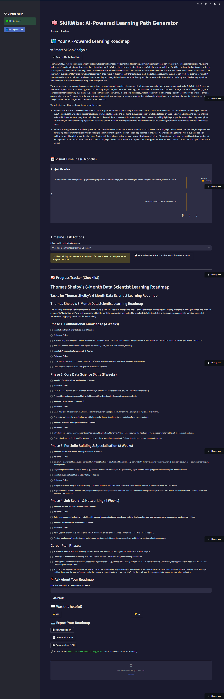

<p align="center">
  
</p>

<h1 align="center">
  🧠 SkillWise – AI-Powered Learning Path Generator
</h1>

<p align="center">
  Upload your resume (PDF or LinkedIn JSON export) and get a personalized 6-month learning roadmap. Features AI-driven skill gap analysis, a visual timeline, job description matching, and more – powered by Gemini 1.5 Flash.
</p>

<p align="center">
  <a href="https://skillwise-sahaj33.streamlit.app/" target="_blank">
    
  </a>
  &nbsp;
  <a href="https://github.com/Sahaj33-op/SkillWise/stargazers">
    
  </a>
  &nbsp;
  <a href="https://github.com/Sahaj33-op/SkillWise/network/members">
    
  </a>
</p>

<p align="center">
  <a href="#-features">🚀 Features</a> •
  <a href="#-screenshots">📸 Screenshots</a> •
  <a href="#-usage">💻 Usage</a> •
  <a href="#-roadmap">🧰 Roadmap</a> •
  <a href="#-license">📜 License</a>
</p>

---

```
░██████╗██╗░░██╗██╗██╗░░░░░██╗░░░░░░██╗░░░░░░░██╗██╗░██████╗███████╗
██╔════╝██║░██╔╝██║██║░░░░░██║░░░░░░██║░░██╗░░██║██║██╔════╝██╔════╝
╚█████╗░█████═╝░██║██║░░░░░██║░░░░░░╚██╗████╗██╔╝██║╚█████╗░█████╗░░
░╚═══██╗██╔═██╗░██║██║░░░░░██║░░░░░░░████╔═████║░██║░╚═══██╗██╔══╝░░
██████╔╝██║░╚██╗██║███████╗███████╗░░╚██╔╝░╚██╔╝░██║██████╔╝███████╗
╚═════╝░╚═╝░░╚═╝╚═╝╚══════╝╚══════╝░░░╚═╝░░░╚═╝░░╚═╝╚═════╝░╚══════╝
```
---


## ✨ Features

- 📄 **Resume Upload**: Supports PDF files and **LinkedIn profile JSON exports**.
- 🧠 **AI Roadmap Generation**: Utilizes Gemini 1.5 Flash for personalized 6-month learning paths.
- 🎯 **Smart AI Gap Detector**: Advanced LLM-based analysis of your resume against ideal profiles for your target role, providing more insightful feedback than simple keyword matching (e.g., "You're missing hands-on experience with REST APIs...").
- 💼 **Job Role Simulator**:
    - Paste a job description to analyze your resume's fit.
    - Generate a focused roadmap specifically to bridge gaps for that particular job.
- 🗓️ **Skill Tracker with Visual Timeline**:
    - Interactive Gantt-style timeline (using Plotly) to visualize your learning journey over 6 months.
    - "Mark Complete" options that sync with the checklist.
    - "Remind Me" buttons (currently toast notifications).
- 🛠️ **Original Skill Gap & Match Score**: Keyword-based analysis (can be used for quick checks).
- 📝 **Free Course Suggestions**: Recommendations from top platforms.
- 💻 **Project Recommendations**: Ideas to build your portfolio.
- ✅ **Progress Checklist**: Track your learning items with persistent local progress saving.
- 🎨 **Theming**: Dark/Light Mode Toggle (though currently defaults to a dark theme).
- 📂 **Download Options**: Export roadmap as `.txt`, enhanced `.pdf` (now includes AI analyses), or `.json`.
- 🔄 **Live Roadmap Editing + Q&A**: Modify and ask questions about your generated roadmap.
- 🗃️ **Multi-role Support**: Caters to various tech roles (e.g., AI PM, Web Dev, Blockchain).

---

## 📸 Screenshots

**Note to Developer (Jules):** Please request the user to update screenshots to reflect the new features. Suggested new screenshots:
1.  **Main UI with LinkedIn JSON upload option visible.**
2.  **Roadmap Tab showing the Gantt Chart / Visual Timeline.**
3.  **Roadmap Tab showing the Smart AI Gap Analysis output.**
4.  **Job Role Simulator expander with a JD pasted and the Fit Analysis shown.**

| Resume Upload (PDF/JSON) | Generated Roadmap with Timeline |
|--------------------------|---------------------------------|
| | 

---

## 💻 Usage

### 🔧 Run Locally

```bash
git clone https://github.com/Sahaj33-op/SkillWise.git
cd SkillWise
pip install -r requirements.txt
# Ensure system dependencies like tesseract-ocr are installed (see packages.txt or below)
streamlit run app.py
```

### 🔐 Add Your API Key

Create a `.env` file in the project root:

```env
GEMINI_API_KEY=your_api_key_here
```
(Note: The app uses `GEMINI_API_KEY` now, previously might have been `GOOGLE_API_KEY`. Ensure consistency.)

Or paste the key directly in the Streamlit sidebar UI.

> ⚠️ **Important**: You must provide a valid Google API Key for Gemini 1.5 Flash to access AI capabilities.

---

### 🛠️ System Dependencies (for OCR, etc.)

Ensure `tesseract-ocr` is installed for PDF text extraction, especially image-based PDFs.
On Debian/Ubuntu:
```bash
sudo apt-get update
sudo apt-get install tesseract-ocr
```
Refer to `packages.txt` for a list of apt dependencies (currently just `tesseract-ocr`).

> 💡 **Windows Users**: If using OCR, install [Tesseract OCR](https://github.com/UB-Mannheim/tesseract/wiki) and ensure it's in your PATH, or update your Python config if needed:
```python
# Example if pytesseract can't find it automatically
# import pytesseract
# pytesseract.pytesseract.tesseract_cmd = r"C:\Program Files\Tesseract-OCR\tesseract.exe"
```

---

<details>
<summary>📦 Click to view an example of <code>requirements.txt</code></summary>

```
streamlit>=1.32.0
PyMuPDF>=1.23.8
google-generativeai>=0.3.2
pytesseract>=0.3.10
Pillow>=10.2.0
reportlab>=4.1.0
nltk>=3.8.1
python-dotenv>=1.0.1
plotly # For Gantt charts
pandas # Dependency for Plotly in this use case
```
(Ensure your `requirements.txt` file is up-to-date with these.)
</details>

---

## 🌐 Try it Online

> ✅ Deployed on [Streamlit Cloud](https://streamlit.io/cloud) (Link might be specific to user's deployment)

🔗 [Open the App](https://skillwise-sahaj33.streamlit.app/) (User's original link)

---

## 🧰 Project Roadmap

- [x] Resume Upload (PDF, LinkedIn JSON) + OCR
- [x] Gemini 1.5 Flash Integration
- [x] Smart AI Skill Gap Detection (LLM-based)
- [x] Job Role Simulator (JD Fit Analysis & Focused Roadmap)
- [x] Visual Timeline / Gantt Chart for Roadmap
- [x] Dark/Light Theme Toggle (currently defaults dark)
- [x] Download as .txt / .pdf (enhanced) / .json
- [x] Live Roadmap Editing
- [x] Interactive Roadmap Q&A
- [ ] **Next Up: Firebase/Supabase Cloud Sync for Progress & True Shareable Links**
- [ ] User Accounts / Authentication
- [ ] Multi-tab Layout (Resume / Roadmap / Export) - *Consider if current tab layout is sufficient or needs redesign.*
- [ ] .EXE Packaging for Windows
- [ ] Full Android App (via Kivy or Pydroid) - *Long-term goal*

---

## 🤝 Contributing

Pull requests are welcome. For major changes, please open an issue first to discuss your ideas.

---

## 📜 License

MIT License – see [`LICENSE`](LICENSE) for full terms.

---

<p align="center"><i>Made with 💡 by Sahaj and AI</i></p>
